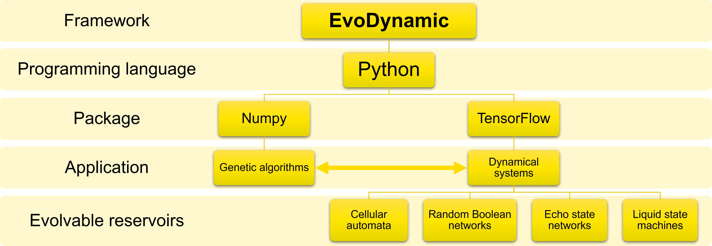

# EvoDynamic
EvoDynamic seeks to evolve and develop suitable discrete dynamic models of self-organizing systems based on local interactions.



Installing EvoDynamic:
```
git clone https://github.com/SocratesNFR/EvoDynamic.git
export PYTHONPATH="/path/to/EvoDynamic":$PYTHONPATH
```

Dependencies used:
* Python 3.6.8
* TensorFlow 2.2.0
* Numpy 1.18.1
* Matplotlib 3.1.1
* Pillow 6.2.1
* powerlaw 1.4.6

## Citing this work

If you use EvoDynamic for academic research, please cite the following [paper](https://link.springer.com/article/10.1007/s11571-020-09600-x):

```
@article{pontes2020neuro,
  title={A neuro-inspired general framework for the evolution of stochastic dynamical systems: Cellular automata, random Boolean networks and echo state networks towards criticality},
  author={Pontes-Filho, Sidney and Lind, Pedro and Yazidi, Anis and Zhang, Jianhua and Hammer, Hugo and Mello, Gustavo BM and Sandvig, Ioanna and Tufte, Gunnar and Nichele, Stefano},
  journal={Cognitive Neurodynamics},
  pages={1--18},
  year={2020},
  publisher={Springer}
}
```

## Other EvoDynamic papers

* [Pontes-Filho, Sidney, et al. "EvoDynamic: A Framework for the Evolution of Generally Represented Dynamical Systems and Its Application to Criticality." International Conference on the Applications of Evolutionary Computation (Part of EvoStar). Springer, Cham, 2020.](https://link.springer.com/chapter/10.1007/978-3-030-43722-0_9)
* [Pontes-Filho, Sidney, et al. "A general representation of dynamical systems for reservoir computing." arXiv preprint arXiv:1907.01856 (2019).](https://arxiv.org/abs/1907.01856)
