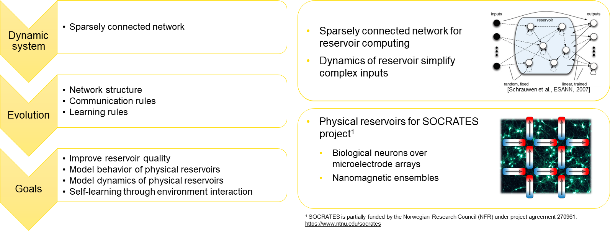

# EvoDynamic
EvoDynamic seeks to evolve and develop suitable discrete dynamic models of self-organizing systems based on local interactions.



Installing EvoDynamic:
```
git clone https://github.com/SocratesNFR/EvoDynamic.git
export PYTHONPATH="/path/to/EvoDynamic":$PYTHONPATH
```

Dependencies used:
* Python 3.6.8
* TensorFlow 2.2.0
* Numpy 1.18.1
* Matplotlib 3.1.1
* Pillow 6.2.1
* powerlaw 1.4.6

## Citing this work

If you use EvoDynamic for academic research, please cite the following [paper](https://arxiv.org/abs/1907.01856):

```
@article{pontes2019general,
  title={A general representation of dynamical systems for reservoir computing},
  author={Pontes-Filho, Sidney and Yazidi, Anis and Zhang, Jianhua and Hammer, Hugo and Mello, Gustavo and Sandvig, Ioanna and Tufte, Gunnar and Nichele, Stefano},
  journal={arXiv preprint arXiv:1907.01856},
  year={2019}
}
```
